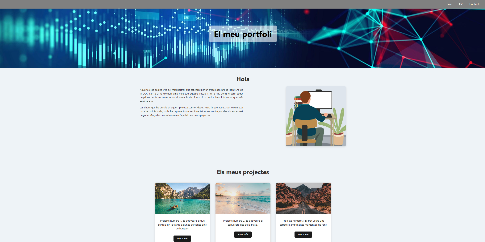
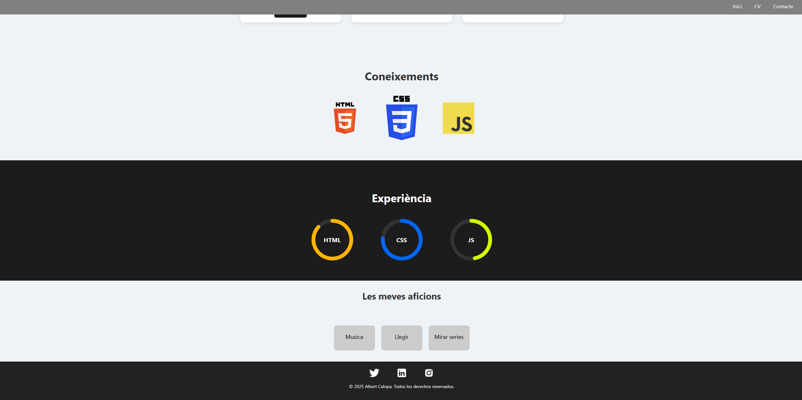
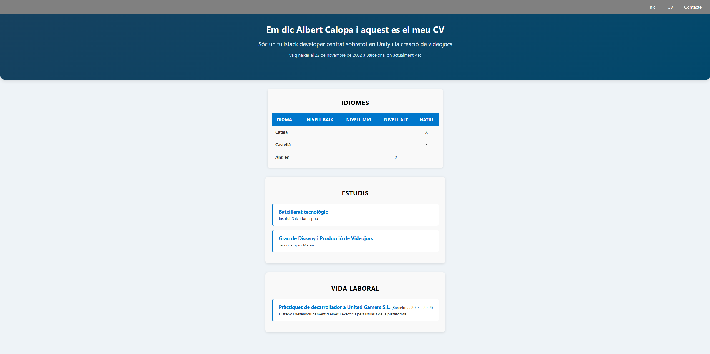
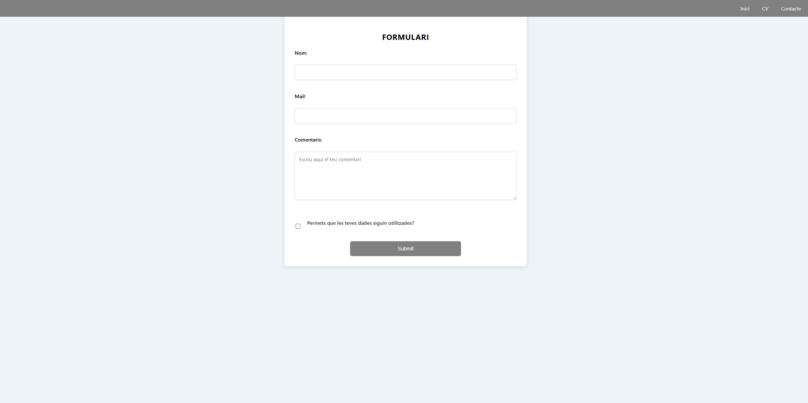

# 📌 Web Portfolio

This is a personal web portfolio developed as part of the Front-End Web Developer course at UOC.  
The project showcases basic layout, styling, and animation techniques using HTML and CSS.

> ⚠️ **Note:** All content is written in Catalan.

## 🚀 Screenshots

## 🧩 Features

- ✅ Three different pages
- ✅ CSS animations
- ✅ Contact form (simulation, not functional)

## 🛠️ Technologies

- HTML5
- CSS3
